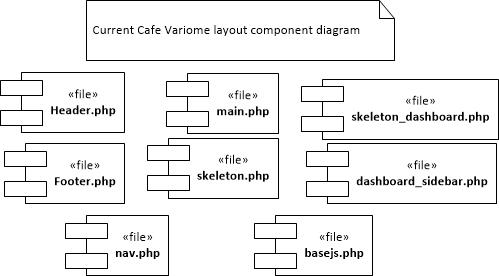

# Migration to Code Igniter 4 and Bootstrap 4 #

**Mehdi Mehtarizadeh**

Migration to CodeIgniter 4 and Bootstrap 4 is necessary at the time of writing. Current CodeIgniter and Bootstrap are obsolete. There are challenges to move the code as the software lacks *technical* and *architecture design documentation*. On the backend side upgrading the code to PHP 7 requires effort. There are major differences in the structure of CodeIgniter 2 and CodeIgniter 4. Moreover, heavy user interfaces currently deployed are dependant on Bootstrap 2. The migration of Bootstrap is expected to bring more unwanted challenges and therefore requires more effort.    
## User Interface Migration ##
---
The user interface benefits from Bootstrap 2.0.2. At the time of writing this report version 4.3.1 is out. The activity diagram for rendering pages is shown in this diagram:

As the code implies, hasNav is probably always true. Therefore, there is no point in having it. Also, some fields in MY_Controller are never used. Such fields include _data_, _pagename_, _fonts_, and _template_.

With support for layout views in codeigniter 4, the traditional way of loading views into a layout seems unnecessary.
In CafeVariome2 the file _skeleton.php_ acts as a master layout. _nav.php_ is loaded into _Header.php_. Then,_Header.php_, and _Footer.php_ are loaded into _main.php_. The result of this is then loaded into the skeleton.

A list of the component files is shown in the diagram below:    

## Back-end Migration ##
---
The core software is written in PHP 5.5. It is expected that some incompatibilities occur as the move to CodeIgniter4 is made.  

### Authentication System ###
---
The authentication is carried out by _ion auth_. It is outdated. Moreover, using _keycloak_ is required as there is a need for a more extensive authentication system. 
Decision has to be taken on deploying both authentication methods (i.e. _keycloak_ and _ion auth_) in the same software package or in separate packages.

## Data Migration ##
---
Data migration in its true essence is not needed as MySQL will be deployed as the main database management system for CafeVariome. The installation software in [Cafe Variome V2](https://github.com/CafeVariomeUoL/CafeVariomeV2) creates 64 databases. According to current team developers, less than 20 tables are in actual use. Current developers suggest to make the move with necessary tables (users, pages, menus, preferences, ...) and then move the rest of the tables if necessary.

### Settings Table ###
---
 The settings table contains important configuration parameters used accross the software. In the current version, it is loaded via a _hook_ in CodeIgniter.
A hook acts like an event that is fired on specified occasions. It is probably integrated in the software to facilitate _Aspect Oriented Programming_. The rows of the _settings_ tables are loaded with the help of a hook. There also some user interface constants in a file named _preferences.php_. It is obvious that the constants of this file are an exact copy of the _themes_ table in the database. As part of the migration to CodeIgniter 4, these two tables are merged into one table under the name _settings_. A singleton class named _Settings_(Settings.php in Models folder) has been created to fetch records from database.
